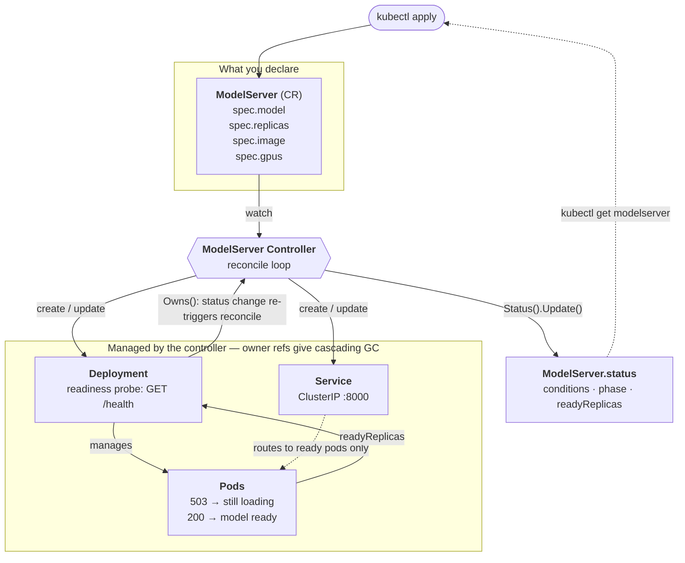

# Nano Kube LLM Server

A Kubernetes controller for declarative LLM inference serving, with model-loading-aware status reporting.

A toy project built to learn the Kubernetes operator pattern from scratch — CRDs, reconciliation loops, owner references, and status subresources — paired with an inference server written from scratch alongside it, so both halves of "serving an LLM on Kubernetes" are real rather than mocked.

## Why not just use a Deployment?

A `Deployment` knows when a container is *running*. It does not know when a model is *loaded*.

For LLM serving, these are very different things. A vLLM pod can be `Running` for 30+ seconds while it pulls weights into GPU memory, during which it cannot serve a single request. That gap — **container running ≠ model ready** — is invisible to built-in workload controllers, and it is the foundation for everything that makes LLM serving different:

- **Graceful drain**: don't kill a pod until its in-flight requests finish
- **LLM-aware autoscaling**: scale on queue depth (`vllm:num_requests_waiting`), not CPU
- **Disaggregated serving**: prefill and decode as separately scaled roles

`ModelServer` exists to give that gap a name, a status field, and a control loop.

## Architecture



Desired state flows **down** (CR → controller → Deployment/Service → Pods); observed state flows back **up** (Pods → Deployment status → controller → `ModelServer.status`). That upward path is what `Owns()` buys: a child's status change re-triggers the parent's reconcile, so status reporting is live rather than only refreshed on user edits.

The readiness probe is the linchpin: while the model is loading, `/health` returns 503, the pod stays un-ready, and Kubernetes automatically keeps it out of the Service's endpoints. No traffic is routed to a pod that cannot answer.

## Status

Early development. Built incrementally as a learning exercise.

| Feature | State |
|---|---|
| `ModelServer` CRD (`serving.fanzhangg.dev/v1alpha1`) | ✅ |
| Reconcile → owned `Deployment` + `Service` | ✅ |
| Owner references + cascading garbage collection | ✅ |
| Drift correction (external changes reverted) | ✅ |
| Status reporting (`Pending → Loading → Ready`) | ✅ |
| Mock inference server (OpenAI-compatible, vLLM-style metrics) | ✅ |
| Real inference — nano-GPT and Qwen3 behind a swappable `Engine` | ✅ |
| GPU scheduling via `spec.gpus` | ✅ |
| Continuous batching | 🚧 in progress |
| Graceful drain | ⬜ planned |
| LLM-aware autoscaling | ⬜ planned |

## API

```yaml
apiVersion: serving.fanzhangg.dev/v1alpha1
kind: ModelServer
metadata:
  name: qwen3-06b
spec:
  model: "Qwen/Qwen3-0.6B"          # HuggingFace repo id — also selects the engine
  replicas: 1
  image: "modelserver-qwen:latest"
  gpus: 0                           # 0 = CPU; 1+ requires the NVIDIA device plugin
```

`spec.model` reaches the pod as both `MODEL_ID` and `MODEL_NAME`, and is what makes the server load real weights — so it must be a genuine HuggingFace repo id, paired with an image that ships the runtime to load it. (A `mock/` prefix asks for the mock engine instead, which is how the no-model demo image is driven.)

Status follows Kubernetes API conventions: `conditions` (`Available`, `Progressing`) are the authoritative source of truth, while `phase` is a derived, display-only projection for `kubectl get`.

The server exposes an OpenAI-compatible `/v1/completions` (streaming supported), a `/health` endpoint that returns 503 until the model is loaded, and `/metrics` with vLLM-style `num_requests_running` / `num_requests_waiting` gauges.

## Quickstart

Requires a running Kubernetes cluster and `kubectl` pointed at it. To create a local one:

```bash
kind create cluster --name nano-kube-llm
```

Install the CRD and run the controller locally against the cluster:

```bash
make install
make run
```

In another terminal, build the serving image and load it into the cluster. Qwen3-0.6B's weights are baked in at build time, so the pod never touches the network — the first build takes a few minutes and downloads ~1.2GB:

```bash
cd model_server
docker build -f docker/Dockerfile.qwen -t modelserver-qwen:latest .   # CPU build, ~2.7GB
kind load docker-image modelserver-qwen:latest --name nano-kube-llm
```

Create the `ModelServer` and watch it come up:

```bash
kubectl apply -f ../config/samples/serving_v1alpha1_modelserver_qwen3.yaml
kubectl get modelserver qwen3-06b -w
```

```
NAME        PHASE     READY
qwen3-06b   Pending   0
qwen3-06b   Loading   0
qwen3-06b   Ready     1
```

`Loading` is the phase this project exists for: the container is running, but `/health` returns 503 while the weights load, so Kubernetes keeps the pod out of the Service's endpoints and no request is routed to it.

Once it reports `Ready`:

```bash
kubectl port-forward svc/qwen3-06b 8000:8000

curl -s localhost:8000/v1/completions \
  -H 'Content-Type: application/json' \
  -d '{"prompt": "What is Kubernetes?", "max_tokens": 64}'
```

Add `"stream": true` for server-sent events. On CPU expect single-digit tokens/sec — slow, but every part of the control loop behaves identically.

### On a GPU cluster

Build `docker/Dockerfile.qwen-gpu` instead and set `gpus: 1` on the CR. The node needs an NVIDIA driver, the container toolkit, and the device plugin DaemonSet; the image carries everything above the driver.

### Without a model

`config/samples/serving_v1alpha1_modelserver.yaml` uses a `mock/` model and a ~150MB image with no weights. Nothing about the control loop — phases, owner refs, readiness gating, queue-depth metrics — needs real inference, so it is the faster loop for controller work.

## Development

```bash
make manifests    # regenerate CRDs and RBAC from Go markers
make generate     # regenerate deepcopy code
make test         # run controller tests (envtest)
make lint         # run golangci-lint
```

The inference server is a separate Python project under [`model_server/`](model_server/):

```bash
cd model_server
uv run pytest             # server + engine tests
uv run python bench.py    # prefill/decode benchmark (needs a GPU)
```

Deploy the controller into the cluster as a pod (instead of `make run`):

```bash
make docker-build IMG=modelserver-controller:v0.1
kind load docker-image modelserver-controller:v0.1 --name nano-kube-llm
make deploy IMG=modelserver-controller:v0.1
```

## Roadmap

1. **Continuous batching** — one scheduler loop serving many concurrent requests, so weight reads amortize across sequences instead of one forward pass per request
2. **Graceful drain** — finalizers + preStop hooks; wait for in-flight requests to complete before terminating a pod during scale-down or rolling update
3. **Custom autoscaler** — reconcile against `vllm:num_requests_waiting` with cooldown, rather than CPU-based HPA
4. **Scale testing** — validate controller behavior with hundreds of `ModelServer` objects using kwok

## License

Apache 2.0
