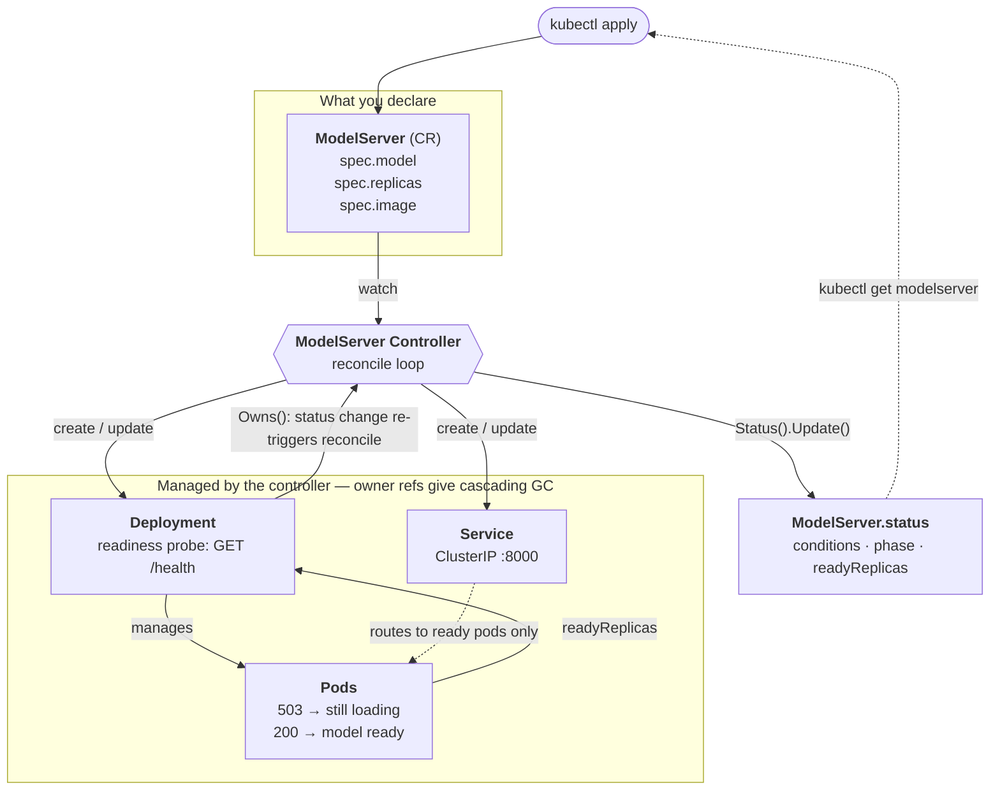

# Nano Kube LLM Server

A Kubernetes controller for declarative LLM inference serving, with model-loading-aware status reporting.

A toy project built to learn the Kubernetes operator pattern from scratch — CRDs, reconciliation loops, owner references, and status subresources.

## Why not just use a Deployment?

A `Deployment` knows when a container is *running*. It does not know when a model is *loaded*.

For LLM serving, these are very different things. A vLLM pod can be `Running` for 30+ seconds while it pulls weights into GPU memory, during which it cannot serve a single request. That gap — **container running ≠ model ready** — is invisible to built-in workload controllers, and it is the foundation for everything that makes LLM serving different:

- **Graceful drain**: don't kill a pod until its in-flight requests finish
- **LLM-aware autoscaling**: scale on queue depth (`vllm:num_requests_waiting`), not CPU
- **Disaggregated serving**: prefill and decode as separately scaled roles

`ModelServer` exists to give that gap a name, a status field, and a control loop.

## Architecture



Desired state flows **down** (CR → controller → Deployment/Service → Pods); observed state flows back **up** (Pods → Deployment status → controller → `ModelServer.status`). That upward path is what `Owns()` buys: a child's status change re-triggers the parent's reconcile, so status reporting is live rather than only refreshed on user edits.

The readiness probe is the linchpin: while the model is loading, `/health` returns 503, the pod stays un-ready, and Kubernetes automatically keeps it out of the Service's endpoints. No traffic is routed to a pod that cannot answer.

## Status

Early development. Built incrementally as a learning exercise.

| Feature | State |
|---|---|
| `ModelServer` CRD (`serving.fanzhangg.dev/v1alpha1`) | ✅ |
| Reconcile → owned `Deployment` + `Service` | ✅ |
| Owner references + cascading garbage collection | ✅ |
| Drift correction (external changes reverted) | ✅ |
| Status fields defined (conditions, phase, observedGeneration) | ✅ |
| Status reporting (`Pending → Loading → Ready`) | 🚧 not yet populated |
| Mock inference server | 🚧 |
| Graceful drain | ⬜ planned |
| LLM-aware autoscaling | ⬜ planned |

## API

```yaml
apiVersion: serving.fanzhangg.dev/v1alpha1
kind: ModelServer
metadata:
  name: qwen-small
spec:
  model: "Qwen/Qwen2.5-0.5B-Instruct"   # passed to the container as MODEL_NAME
  replicas: 2
  image: "modelserver-mock:latest"
```

Status follows Kubernetes API conventions: `conditions` (`Available`, `Progressing`) are the authoritative source of truth, while `phase` is a derived, display-only projection for `kubectl get`.

## Quickstart

Requires a running Kubernetes cluster and `kubectl` pointed at it. To create a local one:

```bash
kind create cluster --name nano-kube-llm
```

Install the CRD and run the controller locally against the cluster:

```bash
make install
make run
```

In another terminal:

```bash
kubectl apply -f config/samples/serving_v1alpha1_modelserver.yaml
kubectl get modelserver,deploy,svc,pod
```

## Development

```bash
make manifests    # regenerate CRDs and RBAC from Go markers
make generate     # regenerate deepcopy code
make test         # run tests
make lint         # run golangci-lint
```

Deploy the controller into the cluster as a pod (instead of `make run`):

```bash
make docker-build IMG=nano-kube-llm-server:v0.1
kind load docker-image nano-kube-llm-server:v0.1 --name nano-kube-llm
make deploy IMG=nano-kube-llm-server:v0.1
```

## Roadmap

1. **Graceful drain** — finalizers + preStop hooks; wait for in-flight requests to complete before terminating a pod during scale-down or rolling update
2. **Real vLLM backend** — the mock server's API surface and metric names already mirror vLLM, so this is mostly an image swap
3. **Custom autoscaler** — reconcile against `vllm:num_requests_waiting` with cooldown, rather than CPU-based HPA
4. **Scale testing** — validate controller behavior with hundreds of `ModelServer` objects using kwok

## License

Apache 2.0
