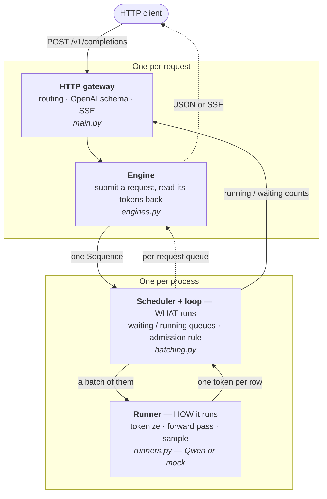

# Model Server

An OpenAI-compatible LLM inference server written from scratch: continuous batching, a
scheduler that owns admission, and a swappable model runner. It is the data plane for the
[`ModelServer` operator](../README.md) in this repo, but it runs standalone too.

## Design

Four files, one boundary each. The rule that keeps them apart: **the scheduler decides what
runs, the runner decides how.**



**One loop, many requests.** A single background task advances the whole batch one token per
tick, and requests can join or leave it mid-flight — which is why `generate()` is not used:
its loop can't be interrupted to do that. Each request reads its own tokens off a queue, so
the HTTP layer never learns that batching exists.

**Admission is the only ceiling.** `max_batch_size` and `max_batch_tokens` decide whether a
request starts; anything that doesn't fit waits in FIFO order. There is no second gate in the
HTTP layer — two ceilings would mean two queues and a metric reporting whichever bound first.
`vllm:num_requests_waiting` is therefore a measurement, not a simulation.

**Adding a model means writing one `ModelRunner` subclass** — everything above it stays put
and never learns the model's name. `torch` is imported per-runner, so the mock runner drives
the *real* scheduler inside a ~150MB torch-free image: the Kubernetes story
(Pending/Loading/Ready, readiness gating, queue-depth autoscaling) exercises the same
scheduling code the GPU image runs.

**Failure is loud.** A forward pass that raises fails every in-flight request and kills the
loop. After a CUDA OOM the allocator is in an unknown state, and a server that keeps
accepting work there returns wrong output instead of an outage — better to let Kubernetes
restart the pod. A client that hangs up frees its slot immediately rather than generating to
`max_tokens` for nobody.

This is the split vLLM and SGLang both arrive at:

| here | vLLM | SGLang |
|---|---|---|
| `Scheduler` | `Scheduler` | `Scheduler` |
| `ForwardBatch` | `SchedulerOutput` | `ForwardBatch` |
| `ModelRunner.execute` | `GPUModelRunner.execute_model` | `ModelRunner.forward` |
| `BatchingEngine` | `AsyncLLM` frontend | `TokenizerManager` |

The per-file docstrings carry the rest — KV-cache hand-off, left padding and RoPE positions,
per-row sampling, thread-safe token hand-back.

## API

| Endpoint | Behaviour |
|---|---|
| `POST /v1/completions` | OpenAI-compatible. `prompt`, `max_tokens`, `temperature`, `stream`, plus vLLM's `top_k` extension. SSE when `stream: true`. |
| `GET /health` | `503` until the model is loaded, then `200`. Drives the readiness probe. |
| `GET /metrics` | Prometheus text: `vllm:num_requests_running`, `vllm:num_requests_waiting`. |

## Configuration

All via environment variables. The controller sets `MODEL_ID`, `MODEL_NAME`, and
`MAX_BATCH_SIZE` from the CR; the rest come from the image.

| Variable | Default | Meaning |
|---|---|---|
| `MODEL_ID` | `""` | HuggingFace repo id. **Configuring a model is the engine selection** — a `mock/` prefix (or empty) serves the mock runner, anything else loads real weights. |
| `MODEL_NAME` | `unknown` | Label reported in `/metrics` and completion responses. |
| `MAX_BATCH_SIZE` | `8` | Concurrent sequences the scheduler will admit. |
| `MAX_BATCH_TOKENS` | `8192` | Total tokens across the running batch. |
| `LOAD_TIME_SECONDS` | `20` | Artificial delay before `/health` flips to 200. `0` in the real images; non-zero makes the mock's `Loading` phase visible. |
| `ENABLE_THINKING` | `false` | Qwen3 reasoning blocks. Left on, it reasons for hundreds of tokens before answering. |

## Usage

### Locally

```bash
cd model_server
uv venv && uv pip install -r requirements-dev.txt
MODEL_ID=Qwen/Qwen3-0.6B MODEL_NAME=qwen3 LOAD_TIME_SECONDS=0 \
  uv run uvicorn main:app --port 8000
```

First run downloads ~1.2GB into `~/.cache/huggingface`. Drop `MODEL_ID` (or set it to
`mock/anything`) to run the mock runner with no weights and no torch.

```bash
curl -s localhost:8000/v1/completions \
  -H 'Content-Type: application/json' \
  -d '{"prompt": "What is Kubernetes?", "max_tokens": 64}'

curl -N localhost:8000/v1/completions \
  -H 'Content-Type: application/json' \
  -d '{"prompt": "Explain RoPE.", "max_tokens": 128, "stream": true}'
```

Any OpenAI client works — point `base_url` at `http://localhost:8000/v1`.

### Images

Build from `model_server/`, not from `docker/` — the `COPY` paths are relative to the build
context.

```bash
docker build -f docker/Dockerfile          -t modelserver-mock:latest .   # ~150MB, no torch
docker build -f docker/Dockerfile.qwen     -t modelserver-qwen:latest .   # ~2.7GB, CPU wheel
docker build -f docker/Dockerfile.qwen-gpu -t modelserver-qwen:gpu   .    # ~8GB, cu128

docker run --rm -p 8000:8000 modelserver-qwen:latest
docker run --rm --gpus all -p 8000:8000 modelserver-qwen:gpu
```

Weights are baked in at build time and `HF_HUB_OFFLINE=1` is set, so a pod never touches the
hub: no re-download per restart, and a missing-weights build fails loudly instead of working
in dev and stalling in a locked-down cluster.

Two images rather than one because most of the Kubernetes story needs no model at all, and
paying 4GB per pod to demonstrate it would be silly.

### On Kubernetes

See the [root README](../README.md) — the controller builds the Deployment, Service, and
readiness probe around this server from a `ModelServer` CR.

## Development

```bash
uv run pytest                # server, scheduler, engine, runner, and OpenAI-SDK tests
uv run python bench.py all   # prefill/decode benchmark, needs a GPU
```

`bench.py` separates the two phases a single tokens/sec number conflates: prefill is compute
bound and sets TTFT; decode is *memory bandwidth* bound, since every token reads all weights
out of VRAM. That distinction is why batching is nearly free. Subcommands: `dtype`, `attn`,
`batch`, `compile`, `roofline`.
